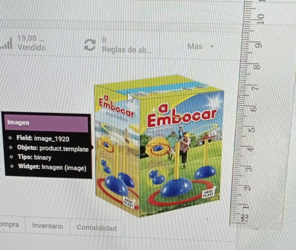

# Manipulando el widget de imagenes



Odoo no tiene una documentación profunda. Para poder sobrevivir hay que saber leer código.

Por ejemplo:
Las imagenes en odoo tienen tamaños preconfigurados. 64px, 128px ,256px etc. 

Como resolvemos cuando nos dicen. 

> Quiero que el alto maximo sea de 6cm en pantalla y el ancho asi mas o menos. 

**Tradución: que tenga un ancho maximo de 256px y un alto maximo de 128px aunque las imagenes sean verticales.**

Una posibilidad seria crear un campo binario para imagen con las caracteristicas requeridas. 
Pero no es la unica solucion. Con una vista tambien podemos hacerlo

El widget de imagen tiene un atributo **options** un diccionario donde puedo definir el campo de la imagen a mostrar **preview_image** y **size** donde defino los tributos width, height y max-with, max-height de la imagen mediante un array [alto,ancho].

Si definieramos size como [256, 180] deformariamos las images que tengan otros ratios de tamaño, por ejemplo las verticales.

Pero si leemos el codigo, vemos que evalua el ancho y el largo por separados. Si definimos el ancho como False entonces el ancho se acomodara al alto.

```javascript
        var width = this.nodeOptions.size ? this.nodeOptions.size[0] : this.attrs.width;
        var height = this.nodeOptions.size ? this.nodeOptions.size[1] : this.attrs.height;
        
        if (width) {
            $img.attr('width', width);
            $img.css('max-width', width + 'px');
        }
        if (height) {
            $img.attr('height', height);
            $img.css('max-height', height + 'px');
        }        
```

Un Ejemplo

```xml
   <record id="name_id_form" model="ir.ui.view">
      <field name="name">product_template_form_view.form</field>
      <field name="model">product.template</field>
      <field name="inherit_id" ref="product.product_template_form_view"/>
      <field name="arch" type="xml">
        <field name="image_1920" position="replace">
                    <field name="image_1920" widget="image" style="float:right;max-heigth:100px;"  options="{'preview_image': 'image_256','size': [False, 180]}'}"/>
        </field>
      </field>
    </record>
 ```
